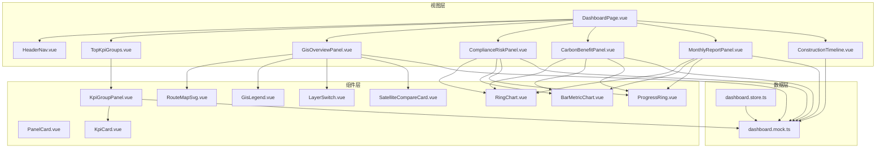

# 罗宜高速 ESG 领导层看板技术架构文档

## 1. 架构设计



## 2. 技术描述

- **框架**：Vue 3（Composition API）+ Vite + TypeScript
- **状态管理**：Pinia
- **HTTP 请求**：Axios（预留）
- **图表库**：ECharts
- **地图实现**：第一版使用 SVG + 百分比坐标；后续可替换为 MapLibre GL / Leaflet
- **样式方案**：SCSS 自定义，不使用通用后台 UI 框架
- **图标**：lucide-vue-next 或自定义 SVG
- **动效**：CSS transition/animation，少量 requestAnimationFrame
- **构建工具**：Vite
- **包管理器**：优先 pnpm，否则 npm

## 3. 目录结构

```text
src/
├── assets/
│   ├── images/
│   └── icons/
├── components/
│   ├── layout/
│   │   ├── HeaderNav.vue
│   │   └── PanelCard.vue
│   ├── kpi/
│   │   ├── KpiGroupPanel.vue
│   │   └── KpiCard.vue
│   ├── gis/
│   │   ├── GisOverviewPanel.vue
│   │   ├── RouteMapSvg.vue
│   │   ├── GisLegend.vue
│   │   ├── LayerSwitch.vue
│   │   └── SatelliteCompareCard.vue
│   ├── charts/
│   │   ├── RingChart.vue
│   │   ├── BarMetricChart.vue
│   │   └── ProgressRing.vue
│   └── panels/
│       ├── ComplianceRiskPanel.vue
│       ├── CarbonBenefitPanel.vue
│       ├── MonthlyReportPanel.vue
│       └── ConstructionTimeline.vue
├── data/
│   └── dashboard.mock.ts
├── stores/
│   └── dashboard.store.ts
├── styles/
│   ├── tokens.scss
│   ├── layout.scss
│   └── dashboard.scss
├── views/
│   └── DashboardPage.vue
└── main.ts
```

## 4. 路由定义

| 路由 | 用途 |
|------|------|
| `/` | 工作台首页（DashboardPage） |

## 5. 数据结构定义

### 5.1 导航

```ts
type NavItem = {
  key: string
  label: string
  active?: boolean
}
```

### 5.2 KPI

```ts
type KpiItem = {
  label: string
  value: string | number
  unit?: string
}

type KpiGroup = {
  key: 'E' | 'S' | 'G'
  title: string
  theme: 'green' | 'blue' | 'purple'
  status: string
  items: KpiItem[]
}
```

### 5.3 GIS

```ts
type RoutePointType = 'compliance' | 'carbon' | 'risk' | 'sensitive' | 'station'

type RoutePoint = {
  id: string
  name: string
  x: number
  y: number
  type: RoutePointType
}

type RouteSegment = {
  id: string
  name: string
  points: [number, number][]
  status: 'normal' | 'warning' | 'risk'
}

type SensitiveArea = {
  id: string
  name: string
  polygon: [number, number][]
}
```

### 5.4 月报

```ts
type MonthlyMaterial = {
  name: string
  owner: string
  deadline: string
}

type MonthlyReport = {
  month: string
  progress: number
  pendingCount: number
  confirmCount: number
  materials: MonthlyMaterial[]
}
```

### 5.5 时间轴

```ts
type TimelineStep = {
  index: number
  label: string
  active?: boolean
  completed?: boolean
}
```

## 6. 开发阶段

### 第一阶段：静态还原

1. 搭建整体布局
2. 完成顶部导航
3. 完成 E/S/G 指标卡
4. 完成 GIS 静态底图和路线视觉
5. 完成右侧三个分析模块
6. 完成底部时间轴

### 第二阶段：数据组件化

1. 所有指标改为 mock 数据驱动
2. 图表接 ECharts
3. GIS 点位、路线、风险区改为配置数据渲染
4. 图层按钮支持筛选显示

### 第三阶段：动态与接口

1. 接入后端 API
2. 支持月报状态刷新
3. 支持地图点位点击弹窗
4. 支持 KPI 下钻跳转
5. 支持不同标段筛选

## 7. 样式体系

```scss
:root {
  --bg-page: #020b18;
  --bg-panel: rgba(5, 18, 38, 0.88);
  --border-blue: rgba(0, 174, 255, 0.55);
  --text-main: #e8f3ff;
  --text-muted: #8fa9c8;
  --green: #69e36f;
  --blue: #2f9cff;
  --purple: #a66cff;
  --cyan: #00e5ff;
  --warning: #ffb347;
  --danger: #ff4f5e;
}
```

所有面板使用深色半透明背景 + 微弱霓虹边框。KPI 数字大字号、高亮色。保持大屏科技感。

## 8. 交互清单

- 顶部导航 hover：蓝色边框亮起。
- KPI 卡 hover：微弱放大和发光。
- 地图点位 hover：显示名称和指标摘要。
- 图层切换按钮：active 状态高亮。
- 时间轴当前阶段：光圈动画。
- 月报进度环：动态变化。
- 图表 resize：自动适配容器。
