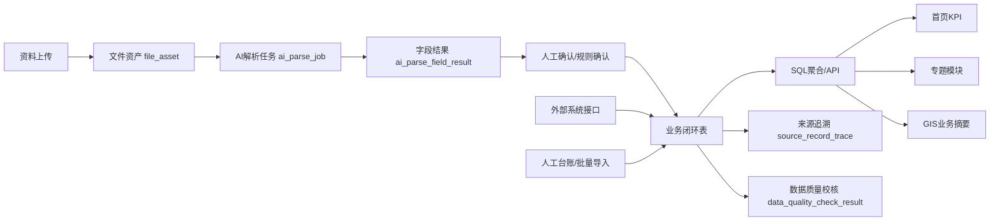

# 领导首页指标数据治理设计 V1.0

更新时间：2026-07-17

## 1. 设计目标

领导首页不应长期依赖“为页面展示而建的快照表”。理想结构应是：

```text
资料上传 / 外部接口 / 人工台账
→ 数据解析与校核
→ 写入业务闭环表或基础资料表
→ SQL 聚合形成首页 KPI、专题、GIS 摘要
→ 前端展示
```

快照表可以作为：

- 原型阶段兜底；
- API 不可用时 fallback；
- 性能缓存；
- 阶段性展示固化结果。

但不应成为长期主数据源。

## 2. 数据来源分层

| 层级 | 数据来源 | 示例 |
|---|---|---|
| 资料上传 | 用户上传 PDF、Excel、图片、压缩包 | 水保监测月报、碳排放活动数据表、高风险作业审批资料 |
| 外部接口 | 第三方系统或业主系统同步 | 安监系统、环保监测系统、许可审批系统、进度系统 |
| 人工台账 | 管理员录入或导入 | 整改事项台账、许可台账、劳务纠纷台账 |
| 空间数据 | GIS 图层、点线面要素 | 标段、弃渣场、水源保护区、边坡监测点 |
| 派生结果 | 由 SQL 或任务计算生成 | KPI 当前值、趋势、构成、月报完成度 |

## 3. 当前已实现的动态链路

| 资料/来源 | 目标业务表 | 驱动页面 |
|---|---|---|
| 环境监测报告 | `env_monitoring_record` | E01 环境监测超标项次 |
| 环保问题整改资料 | `env_issue_record` | E02 当前未闭环环保问题 |
| 水保监测月报 | `water_protection_issue` | E03 当前未闭环水保问题 |
| 碳排放活动数据表 | `carbon_emission_activity` | E04、碳足迹专题 |
| 安全事故台账 | `safety_incident_record` | S01 连续安全生产天数 |
| 高风险作业审批资料 | `safety_risk_point` | S02 较大及以上安全风险点 |
| 劳务纠纷台账 | `labor_dispute_record` | S03 当前未办结劳务纠纷 |
| 群众诉求台账 | `appeal_record` | S04 当前未办结群众诉求 |
| 临时用地/许可资料 | `permit_record` | G02 当前临期及逾期许可事项 |
| 报批报建资料 | `compliance_procedure` | G01 当前未完成法定报批报建事项 |
| NCR/整改资料 | `rectification_record` | G03 未关闭整改事项 |
| 合规资料补齐材料 | `compliance_material_gap` 状态更新 | G04 当前待补齐合规资料 |

当前已通过自动化验收：

```text
上传资料 → 解析 → 确认入库 → 写业务表 → 首页指标变化 → 自动复位
```

## 4. 首页 KPI 建议主数据源

| KPI | 推荐主表 | 当前状态 |
|---|---|---|
| E01 环境监测超标项次 | `env_monitoring_record` | 已业务表聚合，已动态入库验证 |
| E02 未闭环环保问题 | `env_issue_record` | 已业务表聚合，已动态入库验证 |
| E03 未闭环水保问题 | `water_protection_issue` | 已业务表聚合，已动态入库验证 |
| E04 碳排放 | `carbon_emission_activity` | 已业务表聚合，已动态入库验证 |
| S01 连续安全生产天数 | `safety_production_record`, `safety_incident_record`, `construction_stage_record` | 已业务表派生，已动态入库验证 |
| S02 较大及以上安全风险点 | `safety_risk_point` | 已业务表聚合，已动态入库验证 |
| S03 劳务纠纷 | `labor_dispute_record` | 已业务表聚合，已动态入库验证 |
| S04 群众诉求 | `appeal_record` | 已业务表聚合，已动态入库验证 |
| G01 报批报建 | `compliance_procedure` | 已业务表聚合，已动态入库验证 |
| G02 许可临期逾期 | `permit_record` | 已业务表聚合，已动态入库验证 |
| G03 整改事项 | `rectification_record` | 已业务表聚合，已动态入库验证 |
| G04 合规资料缺口 | `compliance_material_gap` | 已业务表聚合，已动态入库验证 |

## 5. 专题模块建议主数据源

### 5.1 合规保障与风险防控成效

推荐数据源：

- `rectification_record`
- `env_issue_record`
- `water_protection_issue`
- `safety_risk_point`
- `compliance_procedure`
- `permit_record`

用途：

- 风险化解；
- 节点保障；
- 停工/处罚统计；
- 重点保障事项。

### 5.2 碳足迹与低碳增益

推荐数据源：

- `carbon_emission_activity`
- `carbon_material_usage`
- `low_carbon_measure`

用途：

- 累计碳足迹；
- 月度碳排趋势；
- 来源构成；
- 减排量；
- 低碳措施；
- 成本影响。

### 5.3 月报准备与输出

推荐数据源：

- `monthly_report_cycle`
- `monthly_report_group_progress`
- `monthly_report_chapter`
- `monthly_report_gap`
- `monthly_report_status_chain`

用途：

- 完成度；
- 待补资料；
- 待确认；
- 章节状态；
- 状态链；
- 输出准备度。

## 6. 推荐数据流



## 7. 快照表定位

当前系统中快照表仍有价值，但定位应收口：

| 快照类型 | 建议定位 |
|---|---|
| `dashboard_kpi_detail_snapshot` | 原型 fallback、字段结构模板、接口异常兜底 |
| `indicator_result` | 首页基础展示兜底，后续逐步被实时聚合覆盖 |
| `dashboard_topic_snapshot` | 专题结构模板、非核心字段兜底 |

长期建议：

1. 高频、低成本统计直接实时 SQL 聚合；
2. 重计算、高成本指标可定时计算进结果表；
3. 结果表必须保留来源口径和更新时间；
4. 前端不直接判断业务逻辑，只展示 API 结果。

## 8. 外部接口数据接入原则

后续不会只有上传资料一种来源，因此外部接口应按同一治理口径接入。

推荐流程：

```text
外部接口原始数据
→ source_api_raw_record
→ 字段映射/清洗
→ 业务闭环表
→ source_record_trace
→ 首页聚合
```

建议新增或完善：

| 表 | 作用 |
|---|---|
| `source_system` | 外部系统登记 |
| `source_api_raw_record` | 原始接口数据暂存 |
| `field_mapping_rule` | 外部字段到业务字段映射 |
| `data_ingestion_job` | 数据接入任务 |
| `source_record_trace` | 来源追溯 |
| `data_quality_check_result` | 质量校核 |

## 9. 数据质量规则

每条入库链路至少需要校核：

1. 必填字段完整性；
2. 日期合法性；
3. 数值范围；
4. 重复文件/重复记录；
5. 业务状态是否合法；
6. 是否影响首页指标；
7. 是否存在来源追溯。

当前已具备：

- 文件哈希去重；
- AI 字段结果；
- 确认入库；
- 入库任务记录；
- 数据质量记录；
- 来源追溯记录；
- 12 条首页指标/专题动态刷新测试。

## 10. 下一阶段优先级

### 优先级 A

当前 12 项首页 KPI 已基本完成动态刷新/业务表派生验收，下一阶段重点转向外部接口原始数据接入和真实文件内容解析。

### 优先级 B

完善真实解析能力：

- Excel 内容读取；
- PDF 文本抽取；
- 图片 OCR；
- 字段在线确认；
- 低置信字段人工修正。

### 优先级 C

接入外部接口：

- 环境监测接口；
- 安全风险系统；
- 许可审批台账；
- 工程进度系统；
- 月报编制系统。

## 11. 当前结论

当前数据库和后端设计已可以支撑“业务表驱动首页”的方向，不需要推倒重来。

后续重点不是继续增加页面快照，而是：

```text
继续扩展业务闭环表
继续扩展资料/接口入库映射
继续增加动态刷新验收
逐步弱化快照表主数据地位
```
