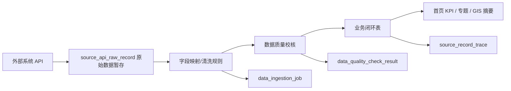

# 罗宜高速 ESG 外部接口数据接入设计 V1.0

更新时间：2026-07-17

## 1. 背景

当前系统已验证“资料上传 → 解析确认 → 写入业务表 → 首页指标动态变化”的链路。但后续真实业务中，首页指标不会只依赖上传资料，还会来自：

- 环境监测设备或监测系统；
- 安全风险/隐患管理系统；
- 报批报建和许可审批系统；
- 工程进度系统；
- 劳务实名制或工资支付系统；
- 信访/群众诉求系统；
- 月报编制系统。

因此需要一套统一的外部接口接入机制，保证外部数据和上传资料最终进入同一批业务表，而不是为不同来源重复建页面表。

## 2. 设计原则

1. 外部接口数据不直接喂给首页；
2. 外部接口数据先进入原始暂存层；
3. 清洗、映射、校核后写入业务表；
4. 首页 KPI、专题、GIS 只读取业务表聚合结果；
5. 每条数据保留来源系统、来源记录 ID、同步时间和质量校核记录；
6. 外部接口与资料上传共用 `data_ingestion_job`、`source_record_trace`、`data_quality_check_result`。

## 3. 推荐数据流



## 4. 建议新增表

### 4.1 `source_system`

登记外部系统。

| 字段 | 说明 |
|---|---|
| `id` | 主键 |
| `system_code` | 系统编码，如 `ENV_MONITOR` |
| `system_name` | 系统名称 |
| `domain` | 业务域：E/S/G/GIS/REPORT |
| `base_url` | 接口基础地址 |
| `auth_type` | 鉴权方式 |
| `enabled` | 是否启用 |
| `sync_owner` | 对接责任人/单位 |

### 4.2 `source_api_endpoint`

登记接口端点。

| 字段 | 说明 |
|---|---|
| `id` | 主键 |
| `system_id` | 外部系统 ID |
| `endpoint_code` | 接口编码 |
| `endpoint_name` | 接口名称 |
| `method` | GET/POST |
| `path` | 接口路径 |
| `sync_frequency` | 同步频率 |
| `target_table` | 默认目标业务表 |
| `enabled` | 是否启用 |

### 4.3 `source_api_raw_record`

原始接口数据暂存。

| 字段 | 说明 |
|---|---|
| `id` | 主键 |
| `system_code` | 来源系统 |
| `endpoint_code` | 来源接口 |
| `source_record_id` | 外部记录 ID |
| `payload_json` | 原始 JSON |
| `payload_hash` | 原始内容哈希 |
| `received_at` | 接收时间 |
| `process_status` | PENDING/SUCCESS/FAILED/DUPLICATE |
| `error_message` | 错误信息 |

### 4.4 `external_field_mapping_rule`

外部接口字段映射规则。

| 字段 | 说明 |
|---|---|
| `id` | 主键 |
| `system_code` | 来源系统 |
| `endpoint_code` | 来源接口 |
| `source_field` | 外部字段路径，如 `data.items[].riskLevel` |
| `target_table` | 目标表 |
| `target_field` | 目标字段 |
| `value_type` | 字段类型 |
| `normalize_rule` | 标准化规则 |
| `required` | 是否必填 |
| `enabled` | 是否启用 |

## 5. 与现有表的关系

外部接口接入后，仍复用现有治理表：

| 现有表 | 用途 |
|---|---|
| `data_ingestion_job` | 记录一次接口同步任务 |
| `data_quality_check_result` | 记录字段完整性、合法性、重复性等校核 |
| `source_record_trace` | 记录外部原始记录到业务表记录的映射 |
| `env_issue_record` | 环保问题 |
| `water_protection_issue` | 水保问题 |
| `carbon_emission_activity` | 碳排活动 |
| `safety_risk_point` | 安全风险点 |
| `compliance_procedure` | 报批报建 |
| `permit_record` | 许可 |
| `rectification_record` | 整改事项 |
| `labor_dispute_record` | 劳务纠纷 |
| `public_complaint_record` | 群众诉求 |

## 6. 首批建议接入接口

| 优先级 | 外部系统 | 数据内容 | 目标业务表 | 驱动页面 |
|---|---|---|---|---|
| A | 环境监测系统 | 扬尘、噪声、水质超标记录 | `env_monitoring_record` | E01 |
| A | 安全风险系统 | 重大/较大风险点、销号状态 | `safety_risk_point` | S02 |
| A | 许可审批台账 | 许可名称、到期日、状态 | `permit_record` | G02 |
| A | 报批报建系统 | 手续名称、办理状态、影响节点 | `compliance_procedure` | G01 |
| B | 整改闭环系统 | 整改事项、状态、复查情况 | `rectification_record` | G03 |
| B | 劳务实名制/工资系统 | 工资支付、纠纷线索 | `salary_payment_record`, `labor_dispute_record` | S03 |
| B | 群众诉求系统 | 投诉、诉求、办理状态 | `public_complaint_record` | S04 |
| C | 月报系统 | 章节、缺项、状态链 | `monthly_report_*` | 月报专题 |

## 7. 接口处理流程

### 7.1 拉取数据

```text
GET/POST 外部接口
→ 保存 payload_json
→ 计算 payload_hash
→ 判断是否重复
```

### 7.2 字段映射

```text
source_api_raw_record.payload_json
→ external_field_mapping_rule
→ 标准字段值
```

### 7.3 数据校核

至少检查：

1. 必填字段；
2. 日期格式；
3. 状态枚举；
4. 数值范围；
5. 同源记录是否重复；
6. 是否能定位到目标业务对象；
7. 是否影响首页指标。

### 7.4 写入业务表

写入策略：

| 场景 | 策略 |
|---|---|
| 新记录 | INSERT |
| 已存在但状态变化 | UPDATE |
| 已存在且无变化 | SKIP |
| 记录撤销/关闭 | UPDATE 状态，不物理删除 |

### 7.5 记录追溯

每条写入必须生成：

```text
source_record_trace
data_quality_check_result
data_ingestion_job
```

## 8. 对首页的影响

首页不感知数据来源，只读聚合 API。

```text
上传资料写入 env_issue_record
外部接口写入 env_issue_record
人工台账写入 env_issue_record
→ E02 统一从 env_issue_record 聚合
```

这样可以避免：

- 前端根据来源做多套逻辑；
- 一个指标多张页面表；
- 资料上传和接口同步结果不一致；
- 后续无法追溯来源。

## 9. API 建议

### 9.1 管理类

```text
GET  /api/admin/source-systems
POST /api/admin/source-systems
GET  /api/admin/source-endpoints
POST /api/admin/source-endpoints
GET  /api/admin/field-mapping-rules
POST /api/admin/field-mapping-rules
```

### 9.2 同步类

```text
POST /api/data-sync/{endpointCode}/pull
GET  /api/data-sync/jobs
GET  /api/data-sync/jobs/{jobId}
GET  /api/data-sync/jobs/{jobId}/quality-results
```

### 9.3 追溯类

```text
GET /api/data-lineage/target/{table}/{id}
GET /api/data-lineage/source/{sourceSystem}/{sourceRecordId}
```

## 10. 自动化验收建议

每个外部接口接入后至少补 3 类测试：

1. 原始数据入库测试；
2. 业务表写入测试；
3. 首页指标动态变化测试。

示例：

```text
环境监测接口 mock payload
→ source_api_raw_record
→ env_monitoring_record
→ E01 从 2 增至 3
→ reset_acceptance_baseline 恢复
```

## 11. 与当前工作的关系

当前已完成的智能入库链路可以视为“文件来源”的一种数据接入方式。

后续外部接口接入只是在来源层新增：

```text
source_type = FILE_UPLOAD
source_type = EXTERNAL_API
source_type = MANUAL_IMPORT
```

目标都是：

```text
业务闭环表
```

首页和专题无需因来源不同而重构。
